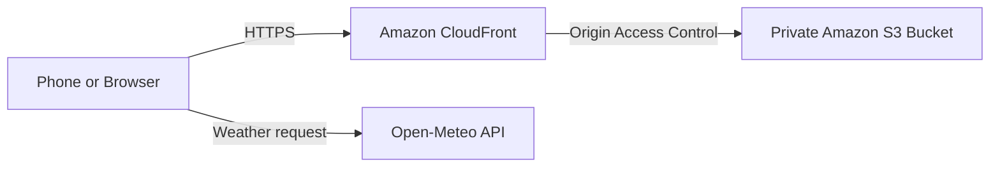

# Weather App

A small mobile-friendly weather application built as a hands-on exercise in application development, containerization, infrastructure as code, and AWS hosting.

**Live application:** https://d27apey3rzosoo.cloudfront.net

## Features

* Uses browser geolocation to determine the user's position
* Retrieves current weather data from Open-Meteo
* Displays temperature, conditions, wind speed, and location
* Responsive interface designed for phones
* Requires no API key
* Served globally over HTTPS through Amazon CloudFront

## Architecture



The production application is completely static. CloudFront serves the files from a private S3 bucket, while the browser retrieves weather information directly from Open-Meteo.

There is no continuously running application server.

## Technology

* HTML, CSS, and JavaScript
* TypeScript and Node.js
* Docker
* OpenTofu
* Amazon S3
* Amazon CloudFront
* Open-Meteo API
* GitHub

## Project Structure

```text
weather-app/
├── public/             Static frontend files
├── src/                TypeScript application code
├── infra/              OpenTofu S3 and CloudFront infrastructure
├── Dockerfile          Container image definition
├── package.json        Node.js scripts and dependencies
└── tsconfig.json       TypeScript configuration
```

## Run Locally

Install dependencies and compile the TypeScript project:

```bash
npm install
npm run build
npm start
```

Open:

```text
http://localhost:3000
```

The browser will request permission to access your location.

## Run with Docker

Build the image:

```bash
docker build --tag weather-app:local .
```

Start the container:

```bash
docker run \
  --detach \
  --rm \
  --name weather-app \
  --publish 3000:3000 \
  weather-app:local
```

Open:

```text
http://localhost:3000
```

Stop the container:

```bash
docker stop weather-app
```

## Infrastructure

The AWS infrastructure is managed with OpenTofu and includes:

* A private, encrypted, versioned S3 bucket
* S3 public-access blocking
* CloudFront Origin Access Control
* An HTTPS CloudFront distribution
* A remote OpenTofu state backend

The infrastructure configuration is provided as a learning reference. Before applying it in another AWS account, update the backend configuration and review all resource settings.

## Security

* The S3 bucket is not publicly accessible
* CloudFront is the only permitted S3 reader
* HTTP requests redirect to HTTPS
* No AWS credentials are stored in the repository
* The complete Git history was scanned with Gitleaks before publication

## Cost Design

The production architecture uses no EC2 instance, load balancer, NAT gateway, or reserved public IP address. S3 and CloudFront remain usage-based services, so they may still generate small charges.

## Weather Data

Weather data is provided by [Open-Meteo](https://open-meteo.com/).
