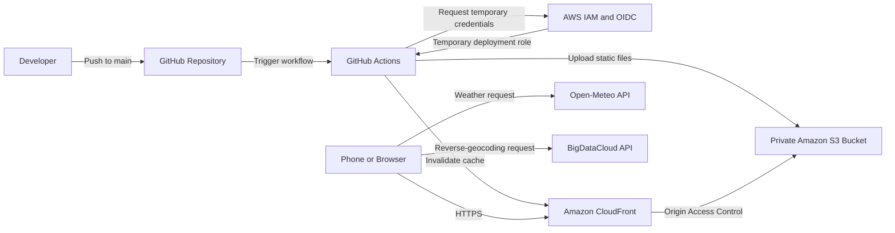

# Weather App

A mobile-friendly weather application built as a hands-on exercise in application development, containerization, infrastructure as code, localization, AWS hosting, and automated deployment.

**Live application:** https://d27apey3rzosoo.cloudfront.net

## Features

* Detects the user's location through browser geolocation
* Displays the current city, region, and country
* Shows current temperature, conditions, humidity, and wind speed
* Provides a five-day forecast
* Supports Fahrenheit with mph and Celsius with km/h
* Supports English and German
* Automatically selects an initial language and measurement system from the browser locale
* Saves language and unit preferences in browser storage
* Responsive interface designed for phones
* Requires no API keys
* Served globally over HTTPS through Amazon CloudFront

## Architecture



The production application is completely static. CloudFront serves the files from a private S3 bucket while the browser retrieves weather and location information directly from external APIs.

There is no continuously running application server.

OpenTofu manages the AWS infrastructure. GitHub Actions manages the deployed website files.

## Technology

* HTML, CSS, and JavaScript
* TypeScript and Node.js
* Browser Geolocation API
* Browser Local Storage
* Docker
* OpenTofu
* Amazon S3
* Amazon CloudFront
* AWS IAM and OpenID Connect
* GitHub Actions
* Open-Meteo API
* BigDataCloud reverse-geocoding API

## Project Structure

```text
weather-app/
├── .github/
│   └── workflows/
│       └── deploy.yml     GitHub Actions deployment workflow
├── public/                Static frontend files
├── src/                   TypeScript application code
├── infra/                 OpenTofu AWS infrastructure
├── Dockerfile             Container image definition
├── package.json           Node.js scripts and dependencies
├── tsconfig.json          TypeScript configuration
└── README.md              Project documentation
```

## Run Locally

Install dependencies and compile the TypeScript project:

```bash
npm ci
npm run build
npm start
```

Open:

```text
http://localhost:3000
```

The browser will request permission to access your location.

## Run with Docker

Build the image:

```bash
docker build --tag weather-app:local .
```

Start the container:

```bash
docker run \
  --detach \
  --rm \
  --name weather-app \
  --publish 3000:3000 \
  weather-app:local
```

Open:

```text
http://localhost:3000
```

Stop the container:

```bash
docker stop weather-app
```

## Infrastructure

The AWS infrastructure is managed with OpenTofu and includes:

* A private, encrypted, versioned S3 bucket
* S3 public-access blocking
* CloudFront Origin Access Control
* An HTTPS CloudFront distribution
* A remote OpenTofu state backend
* A GitHub OpenID Connect identity provider
* A least-privilege IAM deployment role

The infrastructure configuration is provided as a learning reference. Before applying it in another AWS account, update the backend configuration, repository identifiers, and other account-specific settings.

## Automated Deployment

Changes to `public/` or the deployment workflow are automatically deployed when pushed to the `main` branch.

The GitHub Actions workflow:

1. Checks out the repository
2. Installs the locked Node.js dependencies
3. compiles the TypeScript project as a validation step
4. Requests temporary AWS credentials through GitHub OIDC
5. Synchronizes the static frontend files to S3
6. Invalidates the CloudFront cache

The workflow can also be started manually from the GitHub Actions page.

No permanent AWS access keys are stored in GitHub.

## Security

* The S3 bucket is not publicly accessible
* CloudFront is the only permitted S3 reader
* HTTP requests redirect to HTTPS
* GitHub receives short-lived AWS credentials through OIDC
* The deployment role is restricted to this repository's `main` branch
* The deployment role can modify only the website bucket and invalidate its CloudFront distribution
* No AWS credentials or API keys are stored in the repository
* Browser preferences remain on the user's device
* The complete Git history was scanned with Gitleaks before publication

## Location Privacy

Location access requires explicit browser permission. After permission is granted, the browser sends the current coordinates directly to Open-Meteo for weather data and BigDataCloud for the human-readable location name.

The application does not store or transmit location information through its own server.

## Cost Design

The production architecture uses no EC2 instance, load balancer, NAT gateway, or reserved public IP address. S3 and CloudFront remain usage-based services, so they may still generate small charges.

## Data Providers

Weather data is provided by [Open-Meteo](https://open-meteo.com/).

Location names are provided by [BigDataCloud](https://www.bigdatacloud.com/).